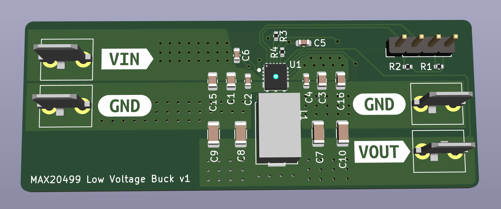

### ** Maxim is not giving up the full datasheet for the MAX20499 without a NDA and "project approval" **
I'm abandoning this board.

## MAX20499C/D

- This design appears to work, in it's default output voltage (0.85V). I can't change it because I can't see the I2C register map without signing a NDA
- Sorta in stock DK and ME
- [Product Page](https://www.maximintegrated.com/en/products/power/switching-regulators/MAX20499C.html)
- Vin; 3-5.5V
- Vout; 0.5-1.275V
- Iout; 16/12A
- I2C adjustable output voltage in 6mV steps!
- [Devkit](https://www.maximintegrated.com/en/products/power/switching-regulators/MAX20499CEVKIT.html)
